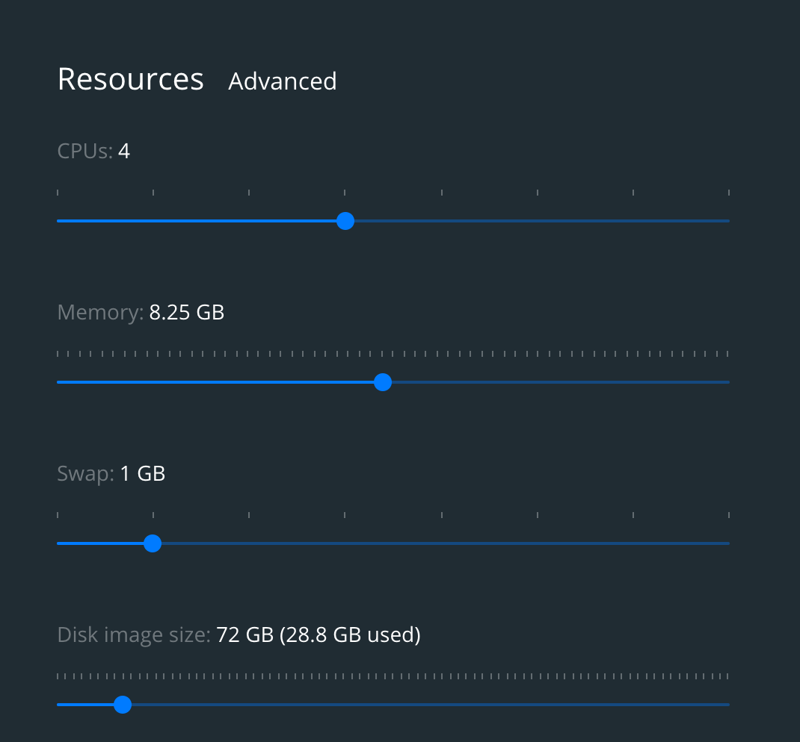
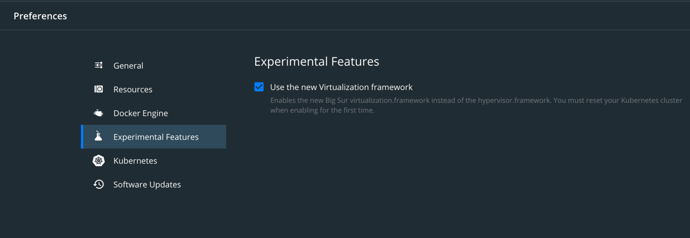

# Apple M1 Build Instructions
In order to get this project to build on a Mac with an M1 or later chip, you will need to do a few things.  As Quill supports 7 distinct databases, we must test against all of them.  This results in a beastly build process.

1. Ensure your Docker Desktop has enough resources.  We recommend you set it for at least 4 CPUs and 8.25GB of RAM.  Anything less will likely result in mysterious hangs/crashes and much wailing and gnashing of teeth during the build process.
    
2. Enable the Experimental 'Big Sur Virtualization'.  Doing so will reduce your build time by nearly 1 hour!  On a MacBook Air with 16gb of ram and the 1st gen M1 chip - the build (w/o codegen) should take around 25 minutes give or take with this setting enabled.
    
3. Use the `docker-compose-m1.yml` file instead of the default `docker-compose.yml` - this adjusts the platform where necessary to match up with the ARM based M1 chip.

## Setup
To get started - be sure to setup the databases needed for the build/test process.  Do so by executing the following:

`docker-compose -f docker-compose-m1.yml --rm setup`

Any time you want to re-setup your databases (i.e. you run `docker-compose down`) - you will need to run that command pointed at the right YAML.

## Compile and Test
To start the build and run tests, its often best to skip the codegen tests as they can sometimes cause phantom errors.  To do this, execute the following:

`docker-compose -f docker-compose-m1.yml run sbt sbt -Dmodules=db test`

Drop the `-Dmodules=db` if you want to run ALL the tests (and grab an adult beverage while it runs - it'll be a while).  Check out the `build.sbt` for a list of the 
various modules you can build together or independently.

## Stop Your Services - Don't Down them!
Be nice to your M1 system - stop your services - don't down them.  Running `docker-compose -f docker-compose-m1.yml down` will stop AND remove all your services.  What this means is the next time you want to run your tests again - you better run setup again or your tests will fail due to missing databases!  

If you plan to have some rapid build/test cycles - run: `docker-compose -f docker-compose-m1.yml stop` to stop your services.  It will preserve the volumes that were created when you ran setup.  It'll save you a good amount of time. 

## Build With a Specific Scala Version
By default the build executes with Scala 2.13.  Not horrible - but if you want to take advantage of the improved compiler of a more recent 2.x verison of Scala you can specify that!
You can simply set the `quill.scala.version` when you start your build:

`docker-compose -f docker-compose-m1.yml run sbt sbt -Dquill.scala.version=2.13.6 -Dmodules=db test`

Check out the [CONTRIBUTING](../../docs/CONTRIBUTING.md) guide for more details.  Good luck!